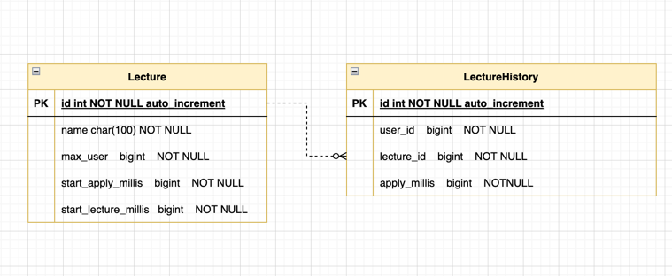

# [항해플러스 과제] 특강 신청 서비스 구현


## API Specs
- 특강 신청 API
- 특강 신청 여부 조회 API

## API 요구사항
### 특강 신청 API
```text
- 특정 userId 로 선착순으로 제공되는 특강을 신청하는 API 를 작성합니다.
- 동일한 신청자는 한 번의 수강 신청만 성공할 수 있습니다.
- 특강은 `4월 20일 토요일 1시` 에 열리며, 선착순 30명만 신청 가능합니다.
- 이미 신청자가 30명이 초과되면 이후 신청자는 요청을 실패합니다.
```

### 특강 신청 여부 조회 API
```text
- 특정 userId 로 특강 신청 완료 여부를 조회하는 API 를 작성합니다.
- 특강 신청에 성공한 사용자는 성공했음을, 특강 등록자 명단에 없는 사용자는 실패했음을 반환합니다.
```

### ERD
