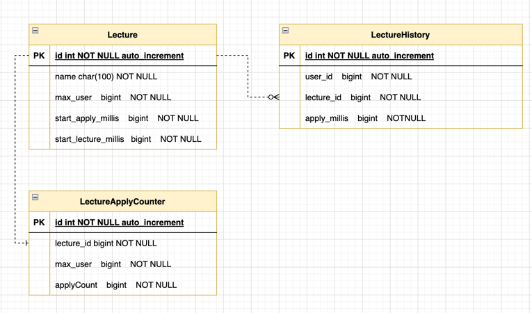

# [항해플러스 과제] 특강 신청 서비스 구현


## API List
### [특강 등록 API](#특강-등록-api) (`추가`)
### [특강 신청 API](#특강-신청-api) (`핵심`)
### [특강 신청 여부 조회 API](#특강-신청-여부-조회-api)


## ERD


## Create Table SQL
```SQL
create table lecture (
    id bigint auto_increment comment '강의 아이디',
    name varchar(255) comment '강의 이름',
    max_user bigint comment '최대 수강생 수',
    start_apply_millis bigint comment '강의 신청 시작 시간',
    start_lecture_millis bigint comment '강의 시작 시간',
    primary key (id)
);

ALTER TABLE lecture COMMENT '강의 메타정보 테이블';

create table lecture_history (
    id bigint auto_increment comment '강의 신청 이력 아이디',
    lecture_id bigint comment '강의 아이디',
    user_id bigint comment '사용자 아이디',
    apply_millis bigint comment '신청 시간',
    primary key (id)
);

ALTER TABLE lecture_history COMMENT '강의 신청 이력 테이블';

```


---

## 요구사항 분석

### 특강 등록 API

- 강의 정보를 저장합니다.
- 강의 이름은 중복될 수 없습니다.

```
POST http://{SERVER_URL}/lecture
```
- **Request body**

| 파라미터             | 타입        | 필수여부 | 설명       | 중복 여부 |
|------------------|-----------|------|----------|-------|
| name             | string    | Y    | 강의 이름    | 중복 불가 |
| maxUser          | integer   | Y    | 최대 수강생 수 |       |
| startApplyMillis | timestamp | Y    | 신청 시작 시간 |       |
| startLectureDate | date      | Y    | 강의 시작 날짜 |       |

- **Response body**

| 파라미터             | 타입        | 필수여부 | 설명       |
|------------------|-----------|------|----------|
| id               | integer   | Y    | 강의 아이디   |
| name             | string    | Y    | 강의 이름    |
| maxUser          | integer   | Y    | 최대 수강생 수 |
| startApplyMillis | timestamp | Y    | 신청 시작 시간 |
| startLectureDate | date      | Y    | 강의 시작 날짜 |


- 실패 케이스
  - `request` 필수값이 `null`이거나 0일 경우
  - `timestamp`나 날짜 형식이 맞지 않거나 과거 시간인 경우
  - 최대 수강생 수가 0이하인 경우

---

### 특강 신청 API

- 특정 userId 로 선착순으로 제공되는 특강을 신청하는 API 를 작성합니다.
- 동일한 신청자는 한 번의 수강 신청만 성공할 수 있습니다.
- 특강은 `4월 20일 토요일 1시` 에 열리며, 선착순 30명만 신청 가능합니다.
- 이미 신청자가 30명이 초과되면 이후 신청자는 요청을 실패합니다.

```
POST http://{SERVER_URL}/{lectureId}/users/{userId}
```
- **Path variable**

| 파라미터                 | 타입      | 필수여부 | 설명      |
|----------------------|---------|------|---------|
| lectureId            | integer | Y    | 강의 아이디  |
| userId               | integer | Y    | 사용자 아이디 |

- **Response body**

| 파라미터        | 타입        | 필수여부 | 설명      |
|-------------|-----------|------|---------|
| userId      | string    | Y    | 사용자 아이디 |
| lectureId   | integer   | Y    | 강의 아이디  |
| applyMillis | timestamp | Y    | 신청 시간   |


- **프로세스**
  - `validate` 특강 인원제한에 걸렸는지 확인 
    - history 및 강의 조회
  - `validate` 이미 신청한 내역이 존재하는지 확인
    - 방안 1) DB 유니크 제약조건 설정 -> 테스트 하기 아려움
    - 방안 2) history 테이블 확인
  - 강의 신청 기록에 저장


- **실패 케이스**
  - 신청자가 N명이 초과 될 경우
  - 이미 신청했을 경우
  - 선택한 강의가 없을 경우


- 동시성 처리
  - 동시에 여러명에 사용자가 신청을 할경우에도 설정한 인원만큼만 신청 가능해야 한다.
  - 비관적 락을 사용하여 행에 일기와 쓰기에 락 적용 
    ```java
    @Lock(LockModeType.PESSIMISTIC_WRITE)
    Optional<Lecture> findById(Long id);
    ```

---

### 특강 신청 여부 조회 API

- 특정 userId 로 특강 신청 완료 여부를 조회하는 API 를 작성합니다.
- 특강 신청에 성공한 사용자는 성공했음을, 특강 등록자 명단에 없는 사용자는 실패했음을 반환합니다.

```
GET http://{SERVER_URL}/{lectureId}/users/{userId}
```
- **Path variable**

| 파라미터                 | 타입      | 필수여부 | 설명      |
|----------------------|---------|------|---------|
| lectureId            | integer | Y    | 강의 아이디  |

- **Response body**
```
true or false
```

- 프로세스
  - 신청 이력 테이블에서 조회
  - 신청에 성공한 경우 -> `true`
  - 신청한 내역이 없는 경우 -> `false`


___

### 고민한 내용
- `DB Lock`을 걸때 낙관적 락과 비관적 락의 차이에 따른 적용
  - `PESSIMISTIC_WRITE`와 `PESSIMISTIC_READ` 의 차이점
- `DB Lock`과 `isolation`의 연관성
- `application`단에서 `DB Lock` 설정을 할 경우 다른 인스턴스에 영향을 끼치는지? 